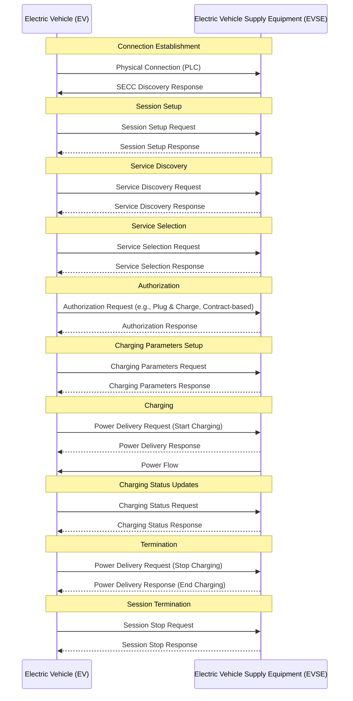
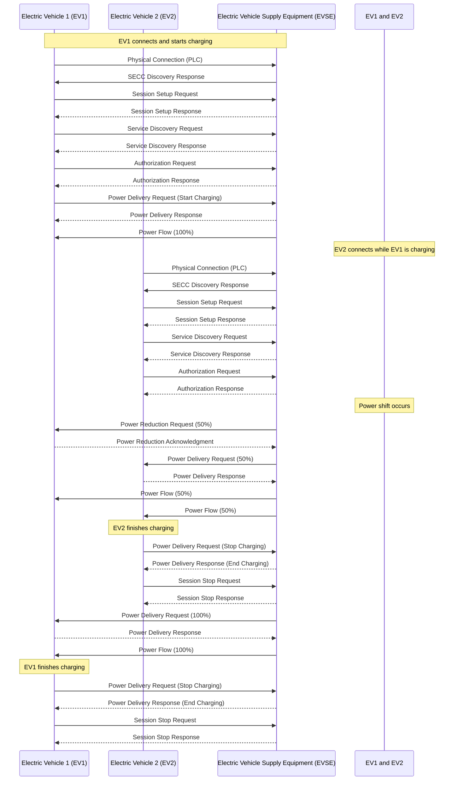
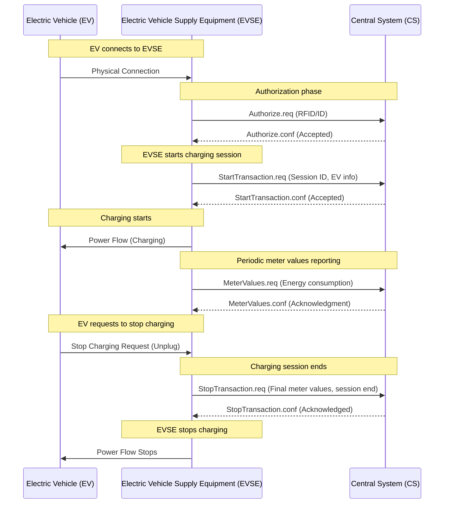

# Vision 

This repository includes several demos of the [EVerest](https://lfenergy.org/projects/everest/) tech stack's capabilities. The intent of this repository is to showcase the foundational layers of a charging solution that could address interoperability and reliability issues in the EV charging industry. The demonstrations aim to exemplify the modular nature of EVerest and can be utilized to understand the following: 

- Standards-based implementations for driving interoperability between the EV, EVSE, and CSMS
- Interoperability testing tools and test suites
- Simulated EVs, EVSEs, etc. following interoperability best practices and simulating stress testing scenarios 

# Hosted Demos

Below is a table of demonstrations that are currently available.

| Demo | Content | Diagram |
| ---- | -- | :---: |
| **One EV ↔ EVSE (AC Simulation)** | Simple AC charging session with one EV connecting to one Charger (EVSE) | [One EV ↔ EVSE (AC Simulation) Diagram](#One-EV-to-EVSE-(AC-Simulation)) |
| **One EV ↔ EVSE (ISO 15118-2 DC)** | ISO 15118-2 compliant charging session with one EV connecting to one EVSE | [One EV ↔ EVSE (ISO 15118-2 DC) Diagram](#One-EV-to-EVSE-(ISO-15118-2-DC))|
| **Two EV ↔ EVSE** | Two EVSE connector points showcasing EVerests ability to work with a CSMS in a multi-station context | [Two EV ↔ EVSE Diagram](#Two-EV-to-EVSE) |
| **E2E Automated Tests** | Performs an automated test of a full charging session| N/A |
| **OCPP Demos** | Various OCPP 1.6J and 2.0.1 compliant charging sessions with differing security profiles| [OCPP Demo Diagram](#OCPP-Demos)|

# Operating System Specific Instructions 

- Mac OS
   - EVerest Demos are currently NOT supported on M1 chips
- Linux
   - No additional steps needed, move to [Install and Set-up](Install-and-Set-up)
- Windows
   - Ensure that you are running Windows 10+
   - Install [Windows Subsystem for Linux](https:://learn.microsoft.com/en-us/windows/wsl/install) (recommended version 2.0)
   - Move to [Install and Set-up](Install-and-Set-up)

# Install and Set-up

1. Install docker with the following link [Get Docker](https://docs.docker.com/get-docker/)

2. Ensure that docker is installed by opening your machines terminal and typing `docker --version`

   - Note: The terminal should return "Docker version x.x.x".

3. Open the Docker desktop application and navigate to the terminal at the bottom of the screen. 

# Step 1: Select the Demo

Copy and paste the command for the demo you wish to run into the Docker terminal within the Docker desktop.

   - Note: Each demonstration has a brief description in the "Content" column and high-level diagram in the "Diagram" column. 

### Demo Commands 

   - **One EV ↔ EVSE (AC Simulation):** `curl https://raw.githubusercontent.com/everest/everest-demo/main/demo-ac.sh | bash`
   - **One EV ↔ EVSE (ISO 15118 AC):** `curl https://raw.githubusercontent.com/everest/everest-demo/main/demo-iso15118-2-dc.sh | bash`
   - **Two EV ↔ EVSE:** `curl https://raw.githubusercontent.com/everest/everest-demo/main/demo-two-evse.sh | bash`
   - **E2E Automated Tests:** `curl https://raw.githubusercontent.com/everest/everest-demo/main/demo-automated-testing.sh | bash`
   - OCPP Demos:
      - **OCPP basic and ISO 15118-2 AC Charging with OCPP 1.6J CSMS (StEVe):** `curl https://raw.githubusercontent.com/everest/everest-demo/main/demo-iso15118-2-ac-plus-ocpp.sh | bash -s -- -j`
      - **OCPP basic and ISO 15118-2 AC Charging with OCPP 2.0.1 CSMS (MaEVe Security Profile 1):** `curl https://raw.githubusercontent.com/everest/everest-demo/main/demo-iso15118-2-ac-plus-ocpp.sh | bash -s -- -1` 
      - **OCPP basic and ISO 15118-2 AC Charging with OCPP 2.0.1 CSMS (MaEVe Security Profile 2):** `curl https://raw.githubusercontent.com/everest/everest-demo/main/demo-iso15118-2-ac-plus-ocpp.sh | bash -s -- -2`
      - **OCPP basic and ISO 15118-2 AC Charging with OCPP 2.0.1 CSMS (MaEVe Security Profile 3):** `curl https://raw.githubusercontent.com/everest/everest-demo/main/demo-iso15118-2-ac-plus-ocpp.sh | bash -s -- -3`
      - **OCPP basic and ISO 15118-2 AC Charging with OCPP 2.0.1 CSMS (CitrineOS Security Profile 1):** `curl https://raw.githubusercontent.com/everest/everest-demo/main/demo-iso15118-2-ac-plus-ocpp.sh | bash -s -- -c -1`

# Step 2: Open Demo Interface and Supporting Materials 

1. Open the demo UI at http://127.0.0.1:1880/ui

   - Note: The demo UI will vary based on the demonstration that is selected. For the best results, having the demo UI and Docker desktop application up side-by-side will allow the user to understand what messages are being sent back-and-fourth across the demo actors. 
     
2. Open the `nodered` flows to understand the module flows at http://127.0.0.1:1880

   - Note: The nodered flows will allow the user to understand how modules interact within the demonstrations. For  more information on simulating Everest with software, the simulation GUI, and NODE RED, click [here](https://everest.github.io/nightly/general/03_quick_start_guide.html#simulating-everest)
 
 
# Step 3: Interact with the Demo

Feel free to explore these demos on your own accord. Below is a table that will help the user understand how to interact with the UI.

Note: Only one demonstration can be run at a time, in order to spin up a new demo, move to Step 4: Teardown before attempting to start new demo.

 

|Features| Description |
| -- | ---- |
|| |
| `CAR PLUGIN` | Starts the charging cycle |
| `STOP & UNPLUG` | Stops the charging cycle |
| `EV PAUSE` | Pause the charging session |
| `EV RESUME` | Resume the charging cycle |
| `Car Simulation` dropdown | Changes the charging scenario (i.e., chaos testing) |
| `Max Current` slider | Slide to adjust the current provided to the vehicle |

   
# Step 4: Teardown

- Select all Docker containers
- Delete all files and containers: `docker compose -p [prefix] down && rm docker-compose.yml` where `[prefix]` is `everest, everest-dc, everest-two-evse...`

# Additional Functionality  

There are many different variables that the user can experiment with throughout the demonstrations. See below:

### One EV ↔ EVSE (ISO 15118 AC) Demo

- When running the Basic and ISO 15118-2 AC Charging with OCPP 1.6J CSMS demo, you can open the SteVe wep portal at http://localhost:8180/steve/manager/home. Login with username: admin, password: 1234
- When running the Basic and ISO 15118-2 AC Charging with OCPP 201 CSMS demo, the script currently checks out the maeve repository and builds it, so it is fairly slow.
  - It starts the Maeve containers in detached mode, so you would need to use docker desktop or `docker logs` to see the logs
  - Note that the OCPP logs are available at `/tmp/everest_ocpp_logs/` on the EVerest manager and can be downloaded using the docker desktop or `docker cp`

### All Demos

- You can experiment with different constraints for a demo by exporting `EVEREST_MANAGER_CPUS` and `EVEREST_MANAGER_MEMORY` environment variables prior to running one of the demos. The values of these variables can take on any valid Docker [CPU value](https://docs.docker.com/config/containers/resource_constraints/#configure-the-default-cfs-scheduler) and [memory limit](https://docs.docker.com/config/containers/resource_constraints/#limit-a-containers-access-to-memory), respectively. For example, to run a demo with two CPUs and 1536 MB of RAM, you could execute

```bash
export EVEREST_MANAGER_CPUS='2.0' EVEREST_MANAGER_MEMORY='1536mb'
```

- This demo can be run independently, and exports [the admin panel](https://everest.github.io/nightly/general/03_quick_start_guide.html#admin-panel-and-simulations) as explained [in this video](https://youtu.be/OJ6kjHRPkyY?t=904).It provides a visual representation of the configuration and the resulting configurations.
  
- Run the explore configs demo: `curl -o docker-compose.yml https://raw.githubusercontent.com/everest/everest-demo/main/docker-compose.admin-panel.yml && docker compose -p everest-admin-panel up`
  
- Access the visual representation at http://localhost:8849

# Appendix Diagrams

The following diagrams provide a visual representation of the above demos.

### One EV to EVSE (AC Simulation)

 ```mermaid

sequenceDiagram

    participant EV as Electric Vehicle (EV)
    participant EVSE as Electric Vehicle Supply Equipment (EVSE)
    EV->>EVSE: Plug-in
    EVSE-->>EV: Proximity Check (PP Signal)
    EV->>EVSE: Detect Proximity
    EVSE-->>EV: Control Pilot Signal
    EV->>EVSE: Signal Response (State A to State B1)
    EVSE-->>EV: Power Available?
    EV-->>EVSE: Ready to Charge (State B2)
    EVSE-->>EV: Start Charging (State B2 to State C2)
    Note over EVSE, EV: Charging in progress
    EV->>EVSE: Request Stop (State C2 to State B)
    EVSE-->>EV: Power Cut Off
    EVSE-->>EV: Control Pilot Signal (State B)
    EV->>EVSE: Unplug (State A)
    Note over EVSE, EV: Session Ends
 
``` 

### One EV to EVSE (ISO 15118 2 DC)



### Two EV to EVSE



### OCPP Demos


