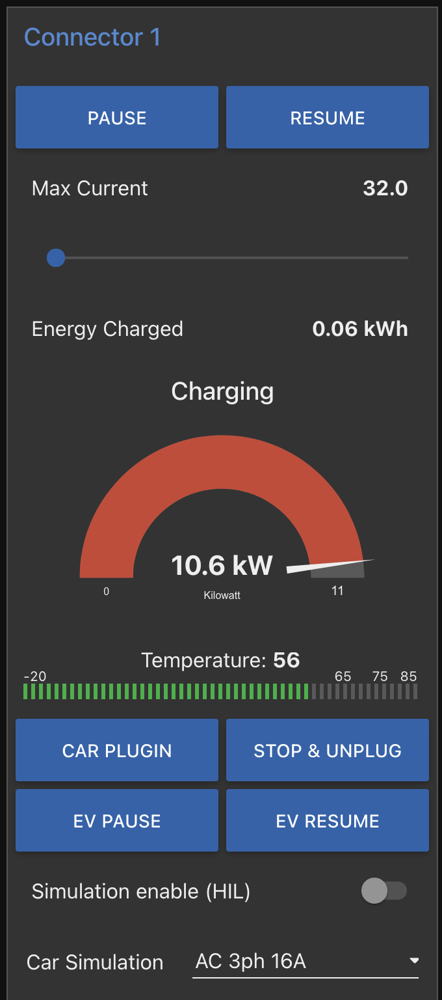
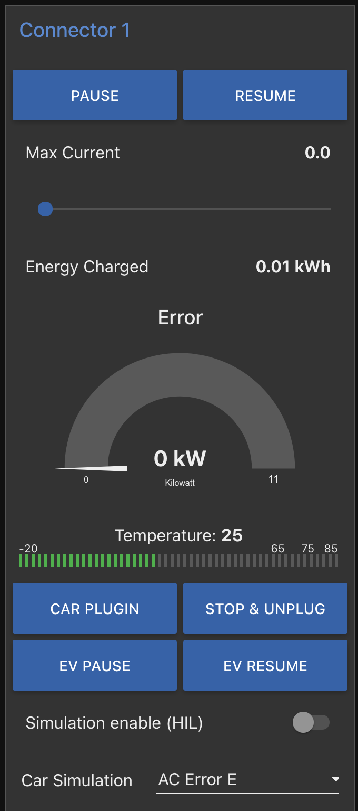
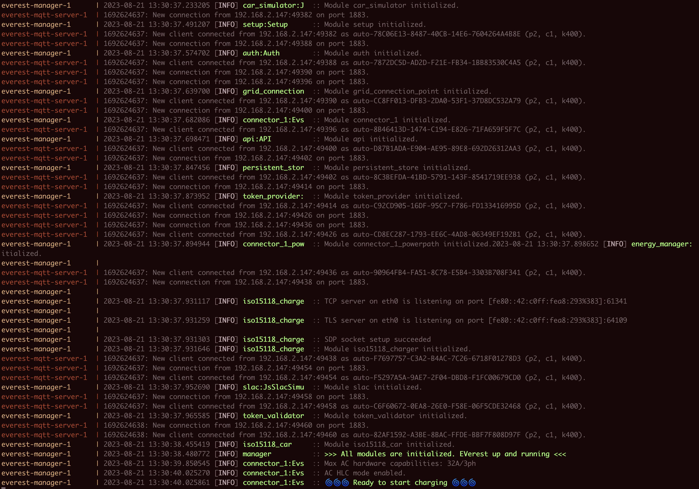

# Quick EVerest demo, 🔋 no setup or software install needed 🔋

## STEP 1: get access to docker

- If you are a developer, you might already have docker installed on your laptop
    - Check that the terminal has access to `docker` and `docker compose`
- If not, you can get a docker-enabled instance in the cloud using play-with-docker (PWD)
    https://labs.play-with-docker.com/
    - Create a docker account at https://hub.docker.com/signup/ (if you do not already have one)
    - Log in with the account at https://labs.play-with-docker.com/
    - Add a new instance
    - Check that the terminal has access to `docker` and `docker compose`

## STEP 2: Run the demo
- Copy and paste the command for the demo you want to see:
    - simple AC charging station: `curl -o docker-compose.yml https://raw.githubusercontent.com/shankari/everest-demo/main/docker-compose.yml && docker compose -p everest up`

## STEP 3: Interact with the demo
- Open the `nodered` flows to understand the module flows
    - On your laptop, go to http://127.0.0.1:1880
    - On PWD, click on the "open port" button and type in 1880
      - allow brower popups if requested, or try opening twice

- Open the demo UI
    - On your laptop, append `/ui` to the URL above
    - On PWD, replace the end of the URL, starting with the hash (e.g. `#flow/9aafbf849d4d6e12)` with `/ui`

| Nodered flows | Demo UI | Including simulated error |
 |-------|--------|------|
 |  |  |  |
 
 

## STEP 4: See the list of modules loaded and the messages transferred between modules

## STEP 5: Clean up after the demo
- Kill the demo process
- Delete files and containers
  - On your laptop: `docker compose -p everest down && rm docker-compose.yml`
  - On PWD: "Close session"

# High level block diagram overview of EVerest capabilities
From https://everest.github.io/nightly/general/01_framework.html

