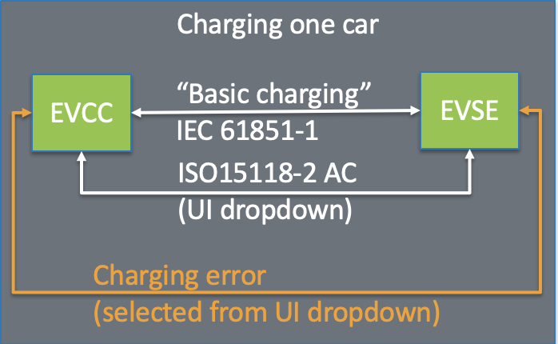
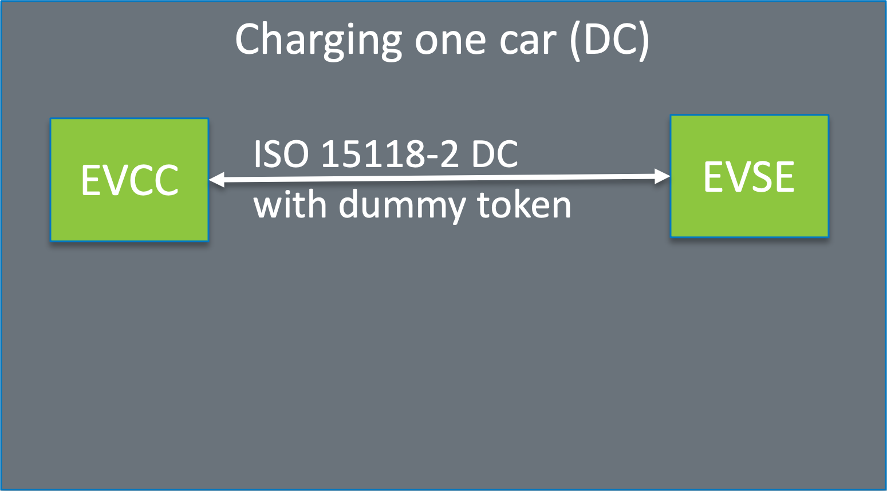
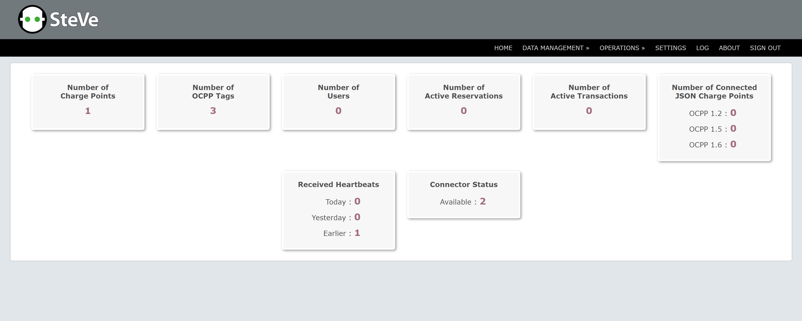

# Quick EVerest Demos

This repository is a repackaging of several simple demos of the EVerest tech stack. Our intent is to showcase the foundational layers of a charging solution that could address interoperability and reliability issues in the industry. EVerest is currently in the _early adoption_ stage of the [LF Energy Technical Project Lifecycle](https://wiki.lfenergy.org/display/HOME/Technical+Project+Lifecycle).

## What is EVerest?
[EVerest](https://lfenergy.org/projects/everest/) is a [Linux Foundation Energy](https://lfenergy.org/) project aiming to provide a modular, open-source framework and tech stack for all manner of electric vehicle chargers. This mission and architecture mean EVerest is well positioned to serve as the base for a reference implementation of a variety of standards that can drive interoperability in the eMobility space.

### Vision
The [US Joint Office of Energy and Transportation (US-JOET)](https://driveelectric.gov/) plans to use EVerest as a baseline from which to collaboratively build reliable interoperability solutions for EV charging, including:
- reference implementations for standards driving interoperability between network actors including EVs, EVSEs, and CSMSs
- interoperability testing tools and test suites
- simulated EVs, EVSEs, etc. following interoperability best practices.

The US-JOET has contributed this repository to the base everest project and continue modifying it to explore additional configurations.

### EVerest currently supports the following standards
- EN 61851
- ISO 15118 (AC wired charging)
    - SLAC / ISO 15118-3 in C++
    - ISO 15118-2 AC
- DC DIN SPEC 70121
- OCPP 1.6J including profiles and security extensions
- Partial OCPP 2.0.1 implementation
    
### Roadmap Items in Development
- Full OCPP 2.0.1 / 2.1
- ISO 15118-20
- Robust error handling/reporting

## SETUP: access docker

- If you are a developer, you might already have docker installed on your laptop. If not, [Get Docker](https://docs.docker.com/get-docker/)
    - Check that the terminal has access to `docker` and `docker compose`
 
## EV ↔ EVSE demos

The demos in this repo showcase connectivity between one or two EVs and an EVSE.
The protocol used by the EV can be selected using a UI dropdown. The dropdown can also be used to simulate errors on the EVCC.
The use cases supported by the three demos are summarized in conceptual block diagrams below.

| Demo | Content |
| ---- |:-------:|
| **One EV ↔ EVSE (AC Simulations)** |  |
| **One EV ↔ EVSE (ISO 15118-2 DC)** |  |
| **Two EV ↔ EVSE** |  |

#### Demo Notes
EVerest is designed with embedded applications in mind. To illustrate this, we've imposed maximum CPU usage and RAM constraints of 100% (1 core) and 1024MB, respectively, in each of the demos. The sole exception is the automated testing demo, where resource constraints are less relevant to the demo's purpose. Even on modest desktop hardware, these constraints should only result in slightly longer boot times.

You can experiment with different constraints for a demo by exporting `EVEREST_MANAGER_CPUS` and `EVEREST_MANAGER_MEMORY` environment variables prior to running one of the demos. The values of these variables can take on any valid Docker [CPU value](https://docs.docker.com/config/containers/resource_constraints/#configure-the-default-cfs-scheduler) and [memory limit](https://docs.docker.com/config/containers/resource_constraints/#limit-a-containers-access-to-memory), respectively. For example, to run a demo with two CPUs and 1536 MB of RAM, you could execute

```bash
export EVEREST_MANAGER_CPUS='2.0' EVEREST_MANAGER_MEMORY='1536mb'
```

in your terminal before one of the one-liners presented in the next section.


### STEP 1: Run the demo
- Copy and paste the command for the demo you want to see:
    - 🚨 AC Charging ⚡: `curl https://raw.githubusercontent.com/everest/everest-demo/main/demo-ac.sh | bash`
    - 🚨 ISO 15118 DC Charging ⚡: `curl https://raw.githubusercontent.com/everest/everest-demo/main/demo-iso15118-2-dc.sh | bash`
    - 🚨 Two EVSE Charging ⚡: `curl https://raw.githubusercontent.com/everest/everest-demo/main/demo-two-evse.sh | bash`
    - 🚨 E2E Automated Tests ⚡: `curl https://raw.githubusercontent.com/everest/everest-demo/main/demo-automated-testing.sh | bash`
    - 🚨 Basic and ISO 15118-2 AC Charging with OCPP 1.6J CSMS ⚡: `curl https://raw.githubusercontent.com/everest/everest-demo/main/demo-iso15118-2-ac-plus-ocpp16j.sh | bash`
    - 🚨 Basic and ISO 15118-2 AC Charging with OCPP 1.6J CSMS ⚡: `curl https://raw.githubusercontent.com/everest/everest-demo/main/demo-iso15118-2-ac-plus-ocpp16j.sh | bash`

### STEP 2: Interact with the demo
- Open the `nodered` flows to understand the module flows at http://127.0.0.1:1880
- Open the demo UI at http://127.0.0.1:1880/ui
- When running the Basic and ISO 15118-2 AC Charging with OCPP 1.6J CSMS demo, you can open the SteVe wep portal at http://localhost:8180/steve/manager/home. Login with username: admin, password: 1234
- When running the Basic and ISO 15118-2 AC Charging with OCPP 201 CSMS demo, the script currently checks out the maeve repository and builds it, so it is fairly slow.
  - It starts the Maeve containers in detached mode, so you would need to use docker desktop or `docker logs` to see the logs
  - Note that the OCPP logs are available at `/tmp/everest_ocpp_logs/` on the EVerest manager and can be downloaded using the docker desktop or `docker cp`

| Nodered flows | Demo UI | Including simulated error |
 |-------|--------|------|
 |  |  |  |

 | SteVe web portal |
 |-------|
 |  |

 

### STEP 3: See the list of modules loaded and the high level message exchange


### OPTIONAL: Explore the configs visually
- This demo can be run independently, and exports [the admin panel](https://everest.github.io/nightly/general/03_quick_start_guide.html#admin-panel-and-simulations) as explained [in this video](https://youtu.be/OJ6kjHRPkyY?t=904).It provides a visual representation of the configuration and the resulting configurations.
- Run the demo: 💄 exploring configs 🔧: `curl -o docker-compose.yml https://raw.githubusercontent.com/everest/everest-demo/main/docker-compose.admin-panel.yml && docker compose -p everest-admin-panel up`
- Access the visual representation at http://localhost:8849

### TEARDOWN: Clean up after the demo
- Kill the demo process
- Delete files and containers: `docker compose -p [prefix] down && rm docker-compose.yml`
where `[prefix]` is `everest, everest-dc, everest-two-evse...`

## High level block diagram overview of EVerest capabilities
From https://everest.github.io/nightly/general/01_framework.html


## Notes for Demo Contributors
Docker images defined in this repository are built during pull requests, on merges to `main`, and on pushes of semantic version tags. The labels for newly-built images are determined by the `TAG` environment variable specified in the root level `.env` file in this repository. The value of `TAG` is also used throughout the demo `docker-compose.*.yml`.
